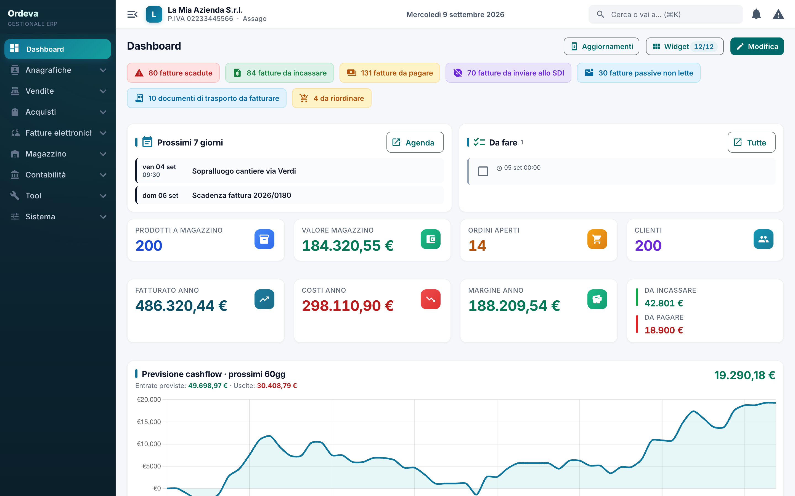

<div align="center">


# Ordeva

**Gestionale ERP desktop, offline e open source.**
Anagrafiche, magazzino, ciclo attivo e passivo, fattura elettronica, contabilità e agenda.
Gira interamente sul tuo computer: nessun account, nessun abbonamento, nessun server.

[**ordeva.it**](https://ordeva.it) · [Funzionalità](https://ordeva.it/funzionalita) · [Scarica](https://github.com/paolodelu95/Ordeva/releases/latest)

[](LICENSE)
[](https://github.com/paolodelu95/Ordeva/releases/latest)
[](https://github.com/paolodelu95/Ordeva/releases)




</div>

---

> ### 🧪 Progetto in *vibecoding*
> Questo software è sviluppato in **vibecoding**: il codice è scritto quasi
> interamente tramite assistenti AI, guidati a conversazione e iterati passo
> passo. Non lo nascondo, è parte dell'esperimento. Di conseguenza possono
> esserci scelte non convenzionali: usalo tenendolo presente, leggi il codice
> prima di metterlo in produzione e segnala pure ciò che non torna.

---

## Indice

- [Cos'è](#cosè)
- [Download](#download)
- [Primo avvio: avviso "app non riconosciuta"](#primo-avvio-avviso-app-non-riconosciuta)
- [Funzionalità](#funzionalità)
- [Roadmap](#roadmap)
- [Aggiornamenti](#aggiornamenti)
- [Sviluppo](#sviluppo)
- [Pubblicare una release](#pubblicare-una-release)
- [Dove sono i dati](#dove-sono-i-dati)
- [Stack tecnico](#stack-tecnico)
- [Licenza](#licenza)

---

## Cos'è

Un ERP completo per la piccola impresa italiana, in un'app desktop che gira **tutta
in locale**:

- **Nessun login**: si apre già pronta, tutti i moduli sbloccati.
- **Dati sul tuo PC**: un file SQLite nella cartella utente. Niente esce dal computer,
  a parte le integrazioni che attivi tu (SDI, Google, marketplace).
- **Multi archivio**: più aziende in file separati, ognuno proteggibile con password.
- **Backup automatico cifrato** (AES-256-GCM) su cartella locale o cloud sincronizzato.
- **Cinque lingue**: italiano, inglese, tedesco, spagnolo, francese. Tema chiaro e scuro.
- **Aggiornamenti automatici firmati** su Windows e Linux.

Il branch attivo è **`offline-electron`**. La vecchia edizione SaaS (multi-utente,
abbonamenti, pannello di amministrazione) non è più mantenuta: resta nel branch `main`
e, per il branch attivo, fino al tag `saas-legacy` — dalla **1.2.89** i suoi residui
sono stati rimossi dal codice.

---

## Download

Pacchetti pronti all'uso dalla pagina
**[Releases](https://github.com/paolodelu95/Ordeva/releases/latest)**:

| Sistema | File |
|---|---|
| **Windows** | `Ordeva_x.y.z_x64-setup.exe` (NSIS) oppure `Ordeva_x.y.z_x64_en-US.msi` |
| **macOS** | `Ordeva_x.y.z_aarch64.dmg` (Apple Silicon) · `Ordeva_x.y.z_x64.dmg` (Intel) |
| **Linux** | `Ordeva_x.y.z_amd64.AppImage` · `ordeva_x.y.z_amd64.deb` · `Ordeva-x.y.z-1.x86_64.rpm` |

---

## Primo avvio: avviso "app non riconosciuta"

I file **non sono firmati digitalmente**: la firma del codice su Windows e macOS è
un servizio a pagamento (certificato Authenticode / Apple Developer Program) che
questo progetto al momento non ha. Per questo il sistema mostra un avviso alla prima
apertura. **Non è un antivirus che ha trovato qualcosa**: è semplicemente un
eseguibile senza editore verificato. Il codice sorgente è tutto qui, verificabile.

**Windows** (SmartScreen, *"Windows ha protetto il tuo PC"*)
Clicca **Ulteriori informazioni** → **Esegui comunque**.

**macOS** (Gatekeeper, *"sviluppatore non identificato"* o *"l'app è danneggiata"*)
1. **Tasto destro** sull'app → **Apri** → conferma **Apri** (non il doppio clic).
2. Se non basta: **Impostazioni di Sistema → Privacy e sicurezza** → **Apri comunque**.
3. In alternativa, da terminale:
   ```bash
   xattr -cr /Applications/Ordeva.app
   ```

**Linux (AppImage)** va reso eseguibile:
```bash
chmod +x Ordeva_x.y.z_amd64.AppImage
./Ordeva_x.y.z_amd64.AppImage
```

> Su Windows e Linux gli aggiornamenti automatici funzionano comunque: il passaggio
> manuale serve solo alla primissima installazione. Su macOS, finché l'app non è
> firmata, resta il download manuale a ogni versione.

---

## Funzionalità

### Anagrafiche
Clienti, fornitori e agenti con validazione P.IVA e codice fiscale, ricerca azienda
per ragione sociale, autocompletamento città, indirizzi multipli. **Doppio ruolo**
(un cliente può essere anche fornitore, tramite record gemello sincronizzato).
Scorciatoie a fatture del cliente e acquisti del fornitore. Import da Excel con
mappatura colonne assistita. Filtri per clienti con insoluti e clienti dormienti.

### Prodotti e magazzino
Prodotti con **varianti** (taglia, colore), barcode con scanner da fotocamera, più
fornitori per prodotto con codice e prezzo dedicato, prezzo d'acquisto e margine.
Peso, dimensioni e immagine (usati in DDT, listini e preventivi). Duplica prodotto,
inserimento rapido, import Excel, **import listino fornitore** con abbinamento fuzzy.
**Magazzini multipli** con giacenze per deposito, **lotti e scadenze**, trasferimenti
e alert. Soglie minime, **proposte di riordino**, rettifica giacenza, inventario a
scansione, movimenti e **arrivi merce**. Creazione rapida prodotto dentro un documento.

### Vendite (ciclo attivo)
**Preventivi** con margine interno visibile solo a video e conversione in ordine o DDT.
**Ordini cliente**, **DDT** (colli e peso calcolati dai prodotti, dati trasporto, firme,
anche reso a fornitore), **Fatture** (anche generate da più DDT), **Note di credito**,
**Fatture ricorrenti**, **Vendita al banco** (cassa veloce, scanner, calcolo resto,
pagamenti misti). **Listini** per cliente con editor a colonne, sconti, override
prezzi, sezioni e stampa PDF a temi.

### Fatturazione elettronica
Generazione **XML FatturaPA** per fatture (TD01) e note di credito (TD04), con
validazione pre-invio. **Invio allo SDI** tramite l'intermediario che configuri in
Impostazioni (URL API + chiave), con tracciamento dello stato per ogni documento:
da inviare, inviata, consegnata, accettata, rifiutata, scartata, decorrenza termini.
**Fatture passive**: import dell'XML del fornitore con creazione bozza acquisto.

### Acquisti (ciclo passivo)
Ordini fornitore, acquisti, carico magazzino, abbinamento prezzi, generazione arrivo
merce dall'acquisto. **Lettura dei documenti**: da un PDF o dalla foto di una fattura
ricava fornitore, P.IVA, numero, data e totali, propone i prodotti a magazzino da
abbinare a ogni riga e ricorda gli abbinamenti per le fatture successive dello stesso
fornitore, aggiornando il prezzo d'acquisto. Gira **in locale, senza account e senza
connessione**: dai PDF il testo si legge direttamente, foto e scansioni passano da un
OCR (Tesseract in WebAssembly) che lavora sul tuo computer — il documento, che contiene
dati di clienti e fornitori, non viene inviato a nessun servizio esterno.

### Contabilità
Pagamenti, **scadenzario** (da incassare e da pagare, giorni residui, saldo rapido
multiplo), **scadenze fiscali**, **prima nota**, **riconciliazione bancaria** con
import OFX/CSV, strumenti di compliance lato applicazione. **Scansione dello scontrino**:
dalla foto ricava data, importo e negozio e pre-compila la registrazione, con la foto
allegata.

### Marketplace e integrazioni
Import degli ordini conclusi da **eBay**, **Amazon** e **Shopify** in sola lettura:
scarico automatico del magazzino e statistiche di vendita per canale, con dialog di
abbinamento SKU → prodotto. Sincronizzazione appuntamenti e attività con **Google
Calendar** e **Google Tasks**. Nessun invio di prezzi o giacenze verso i canali.

### Trasversali
**Dashboard** con KPI e previsione di cassa a 60 giorni. **Report** con andamento anno
su anno, analisi ABC clienti, stagionalità, margini per prodotto. **Agenda** con
appuntamenti, promemoria e cose da fare. **Storico** (audit log delle modifiche).
**Portachiavi** password cifrato con master password dedicata. **Lavagna** di post-it.
**Stampe PDF personalizzabili** con editor della grafica documento, temi e anteprima
live. **Ricerca globale / palette comandi** (⌘K) e inserimento da tastiera.
**Impostazioni**: dati azienda, numerazione, tipi e causali di pagamento, categorie,
unità di misura, aliquote IVA, note rapide.

---

## Roadmap

Stato reale di quello che manca, senza promesse di date. Le proposte sono benvenute:
apri una [issue](https://github.com/paolodelu95/Ordeva/issues).

### 🔨 In lavorazione

- **Amazon (Selling Partner API)** — il client è scritto e compila: consenso OAuth,
  rinnovo token, import ordini in sola lettura senza dati personali dell'acquirente.
  Manca la registrazione come sviluppatore SP-API e l'approvazione dell'app da parte
  di Amazon. Finché i secret non ci sono, la card resta "in attesa" nelle Impostazioni.
  Checklist completa in [`docs/AMAZON-SP-API.md`](docs/AMAZON-SP-API.md).
- **eBay in produzione** — l'integrazione funziona in ambiente **Sandbox**. Serve il
  passaggio alle credenziali di Produzione (`EBAY_SANDBOX` a vuoto).
- **Sito pubblico ordeva.it** — le pagine sono pronte in [`site/`](site); manca la
  pubblicazione su Cloudflare Pages e il puntamento del dominio.
  Guida in [`docs/SITO-PUBBLICO.md`](docs/SITO-PUBBLICO.md).

### 📋 Prossimi passi

- **Paginazione delle sincronizzazioni** — oggi ogni giro di sync legge **una sola
  pagina**: eBay 50 ordini, Shopify 250, Amazon e Google Calendar/Tasks la prima
  pagina. Un account molto attivo perderebbe il resto finché non si seguono i cursori
  (`next`, `NextToken`, `nextPageToken`).
- **Rinnovo preventivo dei token OAuth** — eBay e Google riusano l'access token finché
  una chiamata non risponde 401. Va anticipato usando `expires_in`, come già fa Amazon.
- **Fatture passive dai provider SDI** — l'import da file XML funziona. Il *polling
  automatico* dai provider è ancora un segnaposto: Aruba è abbozzato,
  Fatture in Cloud e Acube sono da fare.
- **Firma del codice** — Authenticode su Windows e Developer ID su macOS. Toglierebbe
  gli avvisi al primo avvio e sbloccherebbe l'**aggiornamento automatico anche su
  macOS**, oggi limitato al download manuale.

### 💭 Da valutare

- **Righe di dettaglio dalle scansioni** — la lettura dei documenti riconosce bene
  intestazione e totali; le singole righe si ricavano in modo affidabile solo dai PDF
  con testo. Su foto e scansioni spesso vanno inserite a mano.

---

## Aggiornamenti

L'app si aggiorna **da sola**. All'avvio l'updater di Tauri controlla le Releases: se
c'è una versione più recente compare un avviso con **Aggiorna ora**, l'app scarica il
pacchetto, **ne verifica la firma**, lo installa e si riavvia. Attivo dalla **1.1.2**.

- I dati restano intatti: vivono fuori dall'app (vedi [Dove sono i dati](#dove-sono-i-dati)).
- **Windows e Linux**: aggiornamento automatico completo.
- **macOS**: finché l'app non è firmata Apple, l'avviso offre il download manuale.

Gli aggiornamenti sono firmati con una chiave privata minisign custodita nei *GitHub
Secrets* (`TAURI_SIGNING_PRIVATE_KEY` e `..._PASSWORD`); la chiave pubblica è in
`src-tauri/tauri.conf.json`. Tauri rifiuta ogni aggiornamento non firmato.

---

## Sviluppo

**Prerequisiti**: Node.js 20+ e Rust 1.77+ (toolchain stable).

```bash
# 1. Frontend Angular
cd frontend
npm install
ng build --configuration offline      # SPA → frontend/dist/frontend/browser

# 2. App desktop (backend Rust + finestra Tauri)
cd ../src-tauri
cargo build                            # build di sviluppo
cargo install tauri-cli                # una volta sola
cargo tauri build                      # pacchetti in target/release/bundle
```

Il backend Rust (axum) gira in-process su `127.0.0.1:3000` e serve sia `/api/*` sia la
SPA; la WebView di sistema (WKWebView, WebView2, WebKitGTK) carica da lì. Il database
SQLite viene creato al primo avvio.

### Anteprima del frontend nel browser

Per lavorare sulla UI senza compilare Rust c'è un **harness di anteprima** che serve
ogni rotta con dati finti:

```bash
cd frontend
ng serve --configuration preview --port 4300
```

Poi apri una rotta con `?app=1&state=full`, ad esempio
`http://localhost:4300/fatture?app=1&state=full`.
Smoke test su tutte le rotte: `node scripts/preview-smoke.mjs`.

### Sito pubblico

Le pagine statiche di [ordeva.it](https://ordeva.it) stanno in [`site/`](site).
Nessun build: si servono così come sono.

---

## Pubblicare una release

Gli eseguibili si pubblicano come **GitHub Releases**, generate da un tag:

```bash
# 1. allinea la versione in src-tauri/tauri.conf.json e src-tauri/Cargo.toml
# 2. commit
git tag vX.Y.Z
git push origin vX.Y.Z
```

Il workflow [`.github/workflows/tauri-release.yml`](.github/workflows/tauri-release.yml)
compila su **Windows, macOS (Intel e Apple Silicon) e Linux**, firma i bundle, crea la
release in bozza, carica gli artefatti dell'updater (`latest.json` e `.sig`) e la
**pubblica da sola** quando tutte le piattaforme hanno finito.

Richiede *Settings → Actions → General → Workflow permissions* = **Read and write**.

---

## Dove sono i dati

Gli archivi vivono nella cartella utente del sistema:

| Sistema | Percorso |
|---|---|
| Windows | `%APPDATA%/Ordeva/data` |
| macOS | `~/Library/Application Support/Ordeva/data` |
| Linux | `~/.config/Ordeva/data` |

Per un backup manuale basta copiare quella cartella. In più l'app fa un **backup
automatico cifrato** nella cartella che imposti (anche su cloud sincronizzato),
ripristinabile dalle Impostazioni, con **restore cross-PC** tramite password.

---

## Stack tecnico

| Livello | Tecnologia |
|---|---|
| Frontend | Angular 21 standalone, Angular Material |
| Backend | Rust, axum, rusqlite (SQLite compilato nel binario) |
| Desktop | Tauri 2, WebView di sistema |
| PDF | jsPDF (generazione), pdf.js (lettura) |
| Lettura documenti | Tesseract in WebAssembly, tutto in locale |
| Crittografia backup e portachiavi | AES-256-GCM |

Il backend era in Node.js/Express dentro Electron: è stato **riscritto in Rust** per
ridurre RAM e dimensione dell'eseguibile, replicando le risposte endpoint per endpoint.
Il packaging Electron è stato rimosso; i sorgenti restano nella storia git
(vedi [`electron/README.md`](electron/README.md)). Note di migrazione in
[`docs/MIGRAZIONE-TAURI-RUST.md`](docs/MIGRAZIONE-TAURI-RUST.md).

---

## Licenza

**AGPL-3.0-or-later** © Paolo De Luca. Vedi [`LICENSE`](LICENSE).

Chi distribuisce il software o lo offre come servizio in rete deve rendere disponibile
il codice sorgente, modifiche incluse. Per usi commerciali senza gli obblighi della
AGPL è disponibile una **licenza commerciale separata** (dual licensing):
[info@ordeva.it](mailto:info@ordeva.it).
